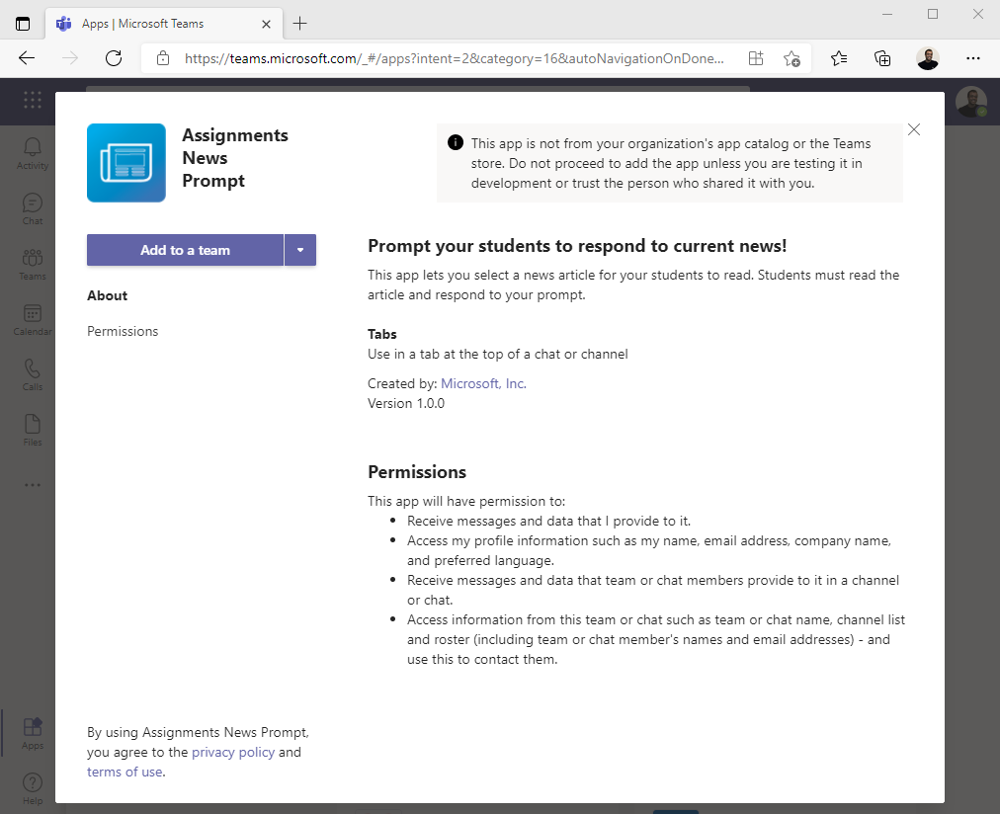
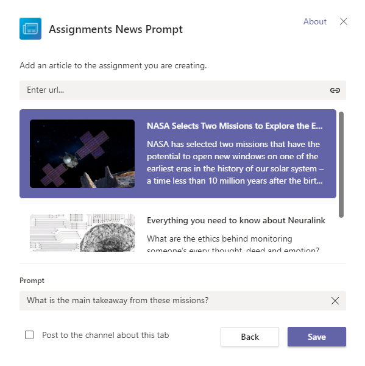
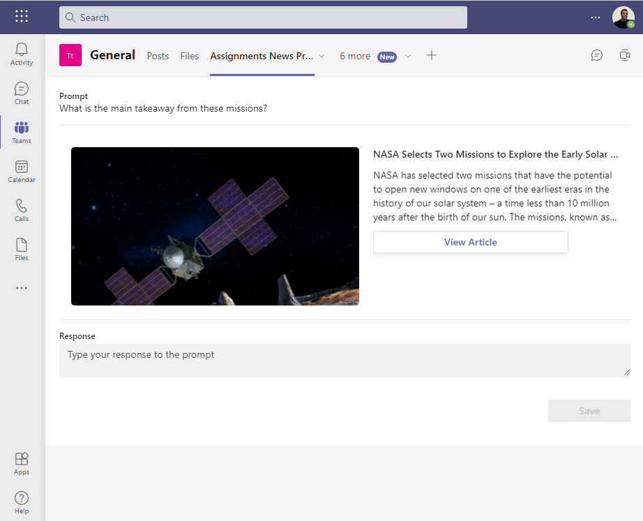

# Assignments News Prompt

This sample demonstrates some best practices for Teams EDU Apps integrated with Assignments:
- Single sign-on (SSO)
- Consistent and accessible UX (via Fluent UI components)
- Content selection during App configuration

You will be able to run this app locally and attach an instance of it to an assignment.

## Prerequisites

- [NodeJS](https://nodejs.org/en/)
- An M365 account. If you do not have M365 account, apply one from [M365 developer program](https://developer.microsoft.com/en-us/microsoft-365/dev-program)
- [Teams Toolkit Visual Studio Code Extension](https://aka.ms/teams-toolkit) or [TeamsFx CLI](https://aka.ms/teamsfx-cli)

## Running the App

Start debugging the project by hitting the `F5` key in Visual Studio Code. Alternatively use the `Run and Debug Activity Panel` in Visual Studio Code and click the `Start Debugging` green arrow button.

<b>Note:</b> The first time you debug the app, the TeamsFx CLI module will create a Teams App with a unique application id in the [Teams Developer Portal](https://dev.teams.microsoft.com/home). It will also provision the necessary Azure resources (e.g. the Azure Active Directory App for supporting SSO authentication).

Add the app to a class team (go through tab configuration and save the app in a new tab).

At this point, the app is installed as a [Teams Tab app](https://docs.microsoft.com/en-us/microsoftteams/platform/tabs/what-are-tabs).
The next section will guide you through attaching it to an assignment.

### Assignments Integration

After you have run the app and added it to a class, the app will be available to attach to an assignment.
1. From an unpublished assignment, click the `...more` button to open the Teams app picker.
2. Select the "Assigments News Prompt" app.
3. Go through the app configuration (e.g. select a news article, add a prompt).
4. Save the configuration.

The configured "Assignments News Prompt" instance is now attached to the assignment. When the assignment is assigned to students, a student will be able to launch the configured app instance and respond to the prompt. Note: Each student's responses will be tied to that student's unique id through use of SSO.

<b>Note:</b> All data created in the sample is stored locally in memory and will reset with each debug session.
